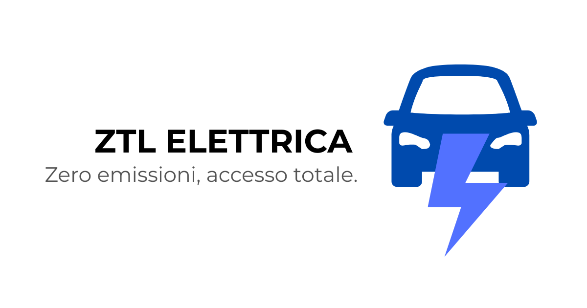

# ZTL Elettrica



ZTL Elettrica è una mappa interattiva delle Zone a Traffico Limitato (ZTL) elettriche in Italia. Questo progetto permette di visualizzare e navigare facilmente le ZTL elettriche in tutto il territorio italiano.

## Caratteristiche

- 🗺️ Mappa interattiva delle ZTL elettriche in Italia
- 🔍 Ricerca e filtraggio delle città
- 📱 Design responsive per dispositivi mobili e desktop
- 📊 Visualizzazione dettagliata delle informazioni ZTL
- 📝 Form per suggerire nuove ZTL

## Come puoi aiutare tramite Pull Request

Puoi contribuire al progetto in diversi modi:

- 🗺️ **Aggiungere nuove ZTL**: Segnala nuove zone a traffico limitato elettriche
- 🔍 **Verificare dati**: Aiuta a verificare l'accuratezza delle informazioni esistenti
- 📝 **Migliorare contenuti**: Suggerisci miglioramenti alle descrizioni e alle informazioni
- 🐛 **Segnalare bug**: Aiuta a identificare e risolvere problemi
- 💡 **Suggerire funzionalità**: Proponi nuove funzionalità per migliorare l'esperienza utente
- 🌐 **Traduzioni**: Aiuta a tradurre l'applicazione in altre lingue

## Requisiti

- Node.js 18+
- npm o yarn

## Installazione

1. Clona il repository:
```bash
git clone https://github.com/EliaTolin/ztl-elettrica.git
cd ztl-elettrica
```

2. Installa le dipendenze:
```bash
npm install
```

3. Crea un file `.env` basato su `.env.example`:
```bash
cp .env.example .env
```

4. Configura le variabili d'ambiente nel file `.env`:
```env
VITE_MAPBOX_ACCESS_TOKEN=your_mapbox_access_token_here
```

5. Avvia il server di sviluppo:
```bash
npm run dev
```

## Configurazione

### Mapbox
Per utilizzare la mappa, è necessario ottenere un token di accesso Mapbox:
1. Crea un account su [Mapbox](https://www.mapbox.com/)
2. Genera un token di accesso pubblico
3. Aggiungi il token nel file `.env`


## Contribuire

1. Fork il progetto
2. Crea un branch per la tua feature (`git checkout -b feature/AmazingFeature`)
3. Commit le tue modifiche (`git commit -m 'Add some AmazingFeature'`)
4. Push sul branch (`git push origin feature/AmazingFeature`)
5. Apri una Pull Request

## Contatti

Per domande o suggerimenti, contattaci su:
- Telegram: [@ztlelettrica](https://t.me/ztlelettrica)
